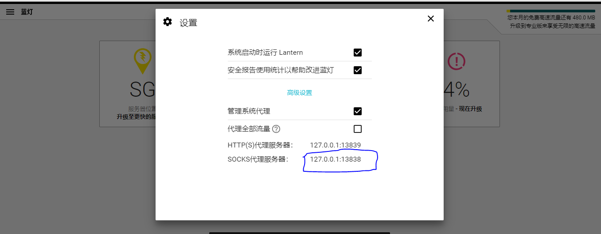

# FBI Warning

受到 [hardseed](https://github.com/yangyangwithgnu/hardseed)(C++) 的启发，开发的 Node.js 种子神器，老司机都懂滴！

## 运行

- `npm install` or `cnpm install` or `yarn` // 安装依赖包
- `npm run test` // 测试代理是否可用
- `npm run dev` // 运行

## 依赖包

- `cheerio` // 解析 DOM
- `iconv-lite` // 解决中文乱码的问题
- `request` // http 请求
- `socks5-http-client` // socks 代理
- `async` // 提高下载并发量

## 科学上网

翻墙才可以爬取，否则爬取失败！

目前只支持 socks 代理，http(s) 代理方式不支持！

我使用的是 [lantern](https://github.com/getlantern/lantern)。更多翻墙方式，[科学上网传送门](https://github.com/search?o=desc&q=%E7%A7%91%E5%AD%A6%E4%B8%8A%E7%BD%91&s=stars&type=Repositories)

在命令行运行 `npm run test`，测试配置的代理是否可用！



代理配置如下：

```js
module.exports = {
  socks: {
    socksPort: 13838, // socks 代理端口
    socksHost: "127.0.0.1" // socks 代理 Host
  }
}
```

## 教程

1. [Node.js 多版本安装](https://www.cnblogs.com/stevexu/p/9734249.html)
2. [Node.js 种子下载器](https://www.cnblogs.com/stevexu/p/9755337.html)

## 功能

1. [x] 解析所有分类
2. [x] 解析所每个分类下的列表页
3. [x] 解析每个页面的种子和图片

## changelog

1. **[2018-10-08,v0.3.0]** 提高下载并发量
1. **[2018-10-04,v0.2.0]** 使用 ES6 Class 改写整个代码
1. **[2018-10-01,v0.1.0]** 完成分类链接获取、列表页链接获取以及下载种子的功能

## 视频下载

本应用最终只能得到种子文件(Torrent 文件)。

使用迅雷解析种子文件，下载视频。

下载视频无需翻墙！！！

## Node.js

- Node.js v8.12.0
- 支持 Windows, Linux, Mac

## LICENSE

[MIT](./LICENSE)

**小撸怡情，大撸伤身！**
