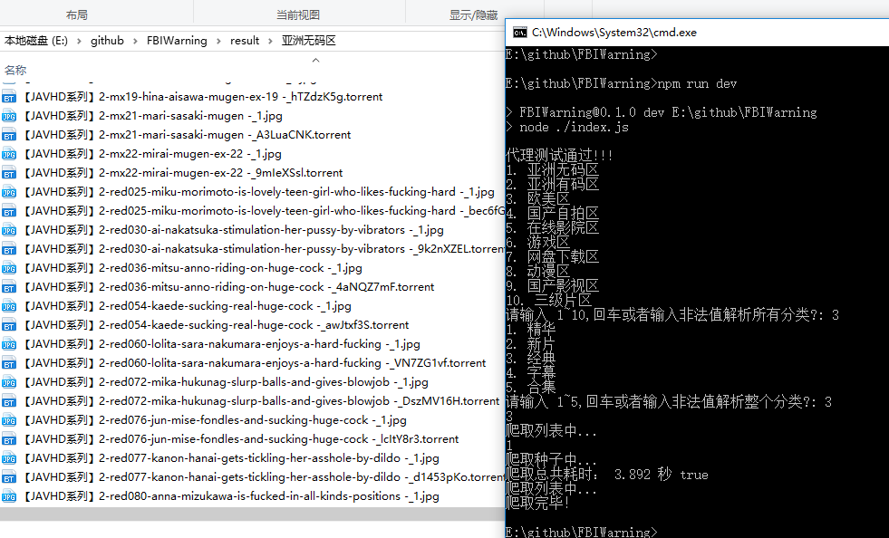

# FBI Warning

受到 [hardseed](https://github.com/yangyangwithgnu/hardseed)(C++) 的启发，开发的 **Node.js** 种子神器，送你硬盘女神。

## 运行

- `npm install` or `cnpm install` or `yarn` // 安装依赖包
- `npm run dev` // 运行

## 科学上网

**翻墙才可以爬取，否则爬取失败！**

目前只支持 **socks** 代理，**http(s)** 代理方式不支持,所以不支持 **socks** 代理的代理软件不能使用。

即使有些代理软件提供了 **socks** 代理功能，可能仍然不能使用，例如 firefly-proxy。测试了其他代理软件的，欢迎提 issue。

更多翻墙方式，[科学上网](https://github.com/search?o=desc&q=%E7%A7%91%E5%AD%A6%E4%B8%8A%E7%BD%91&s=stars&type=Repositories)。

项目会自动测试代理是否可用的！
控制台输出 **代理测试通过!!!** 表示代理可用，否则代理不可用。

支持的代理软件

- [lantern](https://github.com/getlantern/lantern)

不支持的代理软件

- [firefly-proxy](https://github.com/yinghuocho/firefly-proxy)
- shadowsocks

`./socks.json` 文件中配置代理，代理配置如下：

```json
{
  "port": 13838,
  "host": "127.0.0.1"
}
```


## 教程

1. [Node.js 安装](https://www.cnblogs.com/stevexu/p/9734249.html)
2. [Node.js 种子下载器](https://www.cnblogs.com/stevexu/p/9755337.html)

## changelog

1. **2018-10-26** 增加子分类的爬取
2. **2018-10-12** 改变爬取策略，加快种子下载速度
3. **2018-10-04** OOP 改写整个代码
4. **2018-10-01** 完成分类链接获取、列表页链接获取以及下载种子的功能

## 下载



本应用最终只能得到种子文件(Torrent 文件)。请使用迅雷解析种子文件，下载视频，下载视频无需翻墙！！！

## Node.js

- Node.js v8.12.0，尽量安装最新稳定版本，否则可能运行报错。
- 支持 Windows, Linux, Mac

## LICENSE

[MIT](./LICENSE)

**小撸怡情，大撸伤身！**
